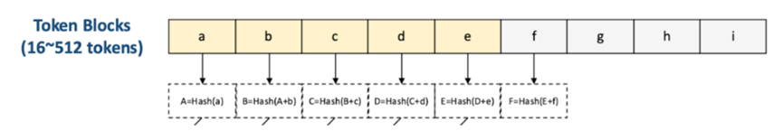

大模型中KV Cache更新算法
－问题背景。

LLM（大语言模型）作为构建智能世界的核心驱动力，成为连接物理世界与数字智能的关键桥梁。在端侧推理过程中，KV Cache 是优化计算效率的关键技术。它将之前计算过的 K 和 V 张量缓存起来，避免在生成后续 token 时重复计算。然而，端侧内存源受限（如手机、平板等），当缓存空间不足时，需要智能地淘汰部分缓存内容，以在有限的内存条件下最大化缓存利用效率。
Token block：当前推理框架为了节省 KV cache 内存占用，会将多个 token 合并成一个 block，并以 block 粒度建立索引来维护其 K 和 V 的值。
由于大模型 transformer 计算特征，KV cache 相比与普通 cache 有两个明显区别，使得传统 cache 管理算法（LRU、FIFO）无法实现最优 KV cache 性能。因此，需要针对 KV cache 负载特征，考虑更多信息设计领域专用算法。
1．	级联计算：每个 token block 的 KV 都取决于其前面的所有 token，因此 token block 的索引也是由前面的 blcok 索引计算得到。
 
2．	共同前缀：在于大模型交互中，为了保持对话上下文，同一个对话 session内通常将之前的 prompt 拼接后再作为当前对话的前缀输入给模型，因此多轮对话都是共享公共前缀的。例如，第一轮 prompt 里每个 block 对应的索引是 $\{1,2,3,4\}$ ，第二轮对话里 block 对应的索引是一定包括 $\{1,2,3$ ， $4\}$ ，而不会只包含中间的部分内容（例如 $\{2,3\}$ ）。

LMCache 介绍。
LMCache［1］是一个专为 LLM 推理设计的分布式 KV 缓存引擎。 LMCache 提供灵活开放的存储接口，可无缝集成多种后端系统。它支持 CPU 卸载、持久化 KV 重用、前缀感知路由等特性。本赛题关注 LMCache 里单节点 DRAM中 KV cache 管理算法。

－题目描述。

本题目要求设计高效的 KV Cache 淘汰算法，在给定的缓存大小限制下，尽可能提高缓存命中率。为了简化，本题目只考虑 prefill 阶段 KV cache 的管理，即只处理用户输入的 prompt，大模型 decode 过程中输出的 token 不予考虑。

参照 LMCache 功能接口，题目将 LMCache 的 KV cache 管理流程独立抽取出来，避免使用全部的大模型环境进行调试，使得学生更容易开发调试。具体地，题目要求实现一个 access 接口，该接口的输入包括当前访问 block 的索引 ID及所在 prompt 的所有 block ID。该接口会在每个 token block 访问时被调用。 access 接口实现里维护 KV cache，具体地根据设计的算法决定将哪些 block 添加或淘汰。另外需要实现 init 接口完成初始化。系统提供 add 和 del 接口，来实现添加和删除一个 block ID。
－评估方法。

为了全面评估参赛算法的性能，评分机制将综合考虑以下四个维度。
缓存命中率：（主要指标，权重：70\％）

命中率稳定性：（权重：15\％）
计算算法在各种缓存大小下的命中率，得到命中率－缓存大小的曲线，曲线下的面积作为得分。
内存占用：（权重：10\％）
本身系统内存受限，因此算法本身不能消耗过多内存。内存使用量作为得分。
算法运行时间：（权重： $5 \%$ ）
接口平时运行时间作为得分，不包括初始化的时间
输入数据格式．

采用和业界实际产品 KV cache 访问的 trace 一样的格式和内容，包括阿里千问和 Kimi 的开源 trace，也包含内部 trace。考虑到 KV cache 的负载特点，trace不仅包含 prompt 数据信息，还包括负载元数据信息和系统内部状态信息，例如应用的类型（对话、搜索、agent 应用等），对话轮次等。对实际产品 trace 对齐，可以使同学们有跟多的信息设计缓存策略，并增强方案解决实际产品问题的能力。
系统会在多个不同缓存大小和测试数据集上运行测试。

·样例输入
```
3
{1, 2, 3, 4} 1
{1, 2, 3, 4, 5} 1
{1, 2, 6} 2
```

# 以下是简单 FIFO（先进先出）的策略样例。

class KVCachePolicy:
    def __init__(self, cache_size):
        """
        初始化缓存策略
        :param cache_size: 缓存大小
        """
        self.cache_size = cache_size
        # 初始化你的数据结构
        self.queue = []

    def access(self, ID, list, type):
        """
        """
        # 你的实现逻辑（FIFO 为例）
        if ID not in self.queue:
            queue.append(ID)
            add(ID)
        if len(self.queue) > self.cache_size:
            k = self.queue.pop(0)
            del(k)
    # 你可以添加其他辅助方法
针对上面的示例数据，缓存大小为 3 ，上述 FIF0 的策略会导致每次访问都 miss，命中率为 0
